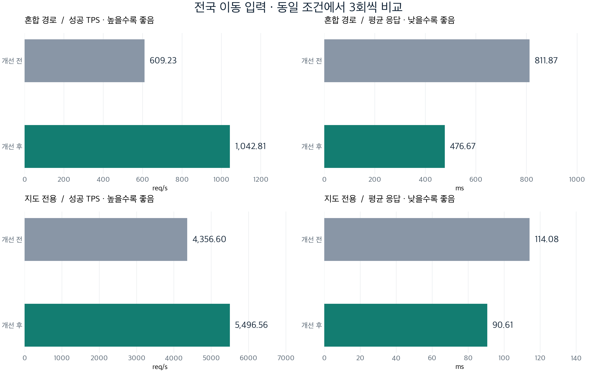

# 전국 이동 검색 성능 개선 · 2026-09-11

지도 조회의 SQL·JPA 변환·Redis 처리·transaction 범위를 개선하고, **고정 좌표 적중 결과 대신 서로 다른 전국 좌표의 전후 비교**를 포트폴리오 근거로 정리했다. 구현 commit은 `b9401d8`, 기준점은 이미 이전 최적화가 적용된 `86cdc70`이다. 운영 배포는 하지 않았다.

## 결과

**현재 성능 테스트 범위는 웹 전용이다.** 후속 지시에 따라 모바일 API를 제외했다. 아래 혼합 결과는 모바일 5%가 포함된 과거 비교로 보존하며 현재 웹 전용 성능으로 제시하지 않는다. 웹 전용 혼합(상세 50%·클러스터 30%·검색 10%·주변 10%)은 재측정 전이다. 아래 지도 전용 결과는 처음부터 모바일 요청이 없었다. [현재 입력 생성·실행](../../scripts/loadtest/MapLatencyRunner.md).

같은 Apple M3 Pro에서 API/DB/Redis/발생기가 자원을 공유한다. 각 시나리오 안에서 전후를 3회씩 교대 실행했고 동시에 500개 요청을 발행했다. **클라우드 운영 용량이나 실제 500명의 이용 행태를 측정한 결과가 아니다.**

| 시나리오 | 성공 TPS 전→후 | 평균 응답 전→후 | 각 실행 p95 범위 전→후 | 완료 요청 / 오류 |
|---|---:|---:|---:|---:|
| 전국 혼합: 상세·클러스터·검색·주변·모바일 | 609.23 → 1,042.81 | 811.87 → 476.67ms | 1,256.67~1,294.75 → 887.10~904.93ms | 300,984 / 0 |
| 전국 지도: 상세·클러스터 | 4,356.60 → 5,496.56 | 114.08 → 90.61ms | 236.17~268.79 → 182.34~211.69ms | 888,680 / 0 |

혼합에서는 처리량 **71.2% 증가**, 평균 지연 **41.3% 감소**였다. 지도 전용에서는 **26.2% 증가**, **20.6% 감소**였다. 합계 **1,189,664건·오류 0건**이며 예열 요청은 이 합계에서 제외했다. 각 measurement 안의 발행 요청은 모두 서로 다른 URI/중심 좌표이고 corpus 순환은 0회였다. 서로 다른 trial 사이에는 같은 입력이 다시 등장할 수 있다.

혼합은 20만 입력·예열 20초·발행 60초·발생기 heap 1GiB, 지도 전용은 40만 입력·예열 15초·발행 30초·발생기 heap 2GiB다. 시나리오끼리 API 비율과 조건이 다르므로 위 두 행을 전후 배수로 연결하지 않는다. 평균은 요청 수 가중값, TPS는 완료 요청/총 경과시간(drain 포함), p95는 **실행별 범위**이며 pooled p95가 아니다. HTTP body 완료까지 측정하는 closed-loop 결과다.

입력은 전국 매장 주변 80%와 대한민국 일부 직사각형 균등 좌표 20%의 합성 분포이며 운영 로그 분포가 아니다. 빈 결과도 포함한다. HTTP 300개 확인 표본 중 compact preview의 빈 결과는 45/139개였고, 이 비율을 전체 부하의 정확한 비율로 주장하지 않는다. 모든 요청이 서울 도심에서 300개 매장을 반환하는 시험과 결과를 혼합하지 않는다.

[전체 방법·환경·재현](measurement-method-2026-09-11.md) · [혼합 이전](evidence/2026-09-11/baseline-mixed-summary.json) / [이후](evidence/2026-09-11/improved-mixed-summary.json) · [지도 이전](evidence/2026-09-11/baseline-map-summary.json) / [이후](evidence/2026-09-11/improved-map-summary.json)

장표 삽입용 [벡터 SVG](figures/api-comparison.svg)와 PNG는 같은 원본 수치로 생성했다.

### 혼합 경로별 평균

| 경로 | 전 | 후 |
|---|---:|---:|
| Compact preview | 909.19ms | 487.98ms |
| Cluster 5 | 485.85ms | 285.42ms |
| Cluster 7 | 486.00ms | 286.11ms |
| Cluster 10 | 487.24ms | 286.56ms |
| Keyword preview | 1,189.19ms | 793.44ms |
| Nearby preview | 918.02ms | 678.01ms |
| Mobile aggregate | 929.93ms | 672.88ms |

정상 cluster의 계산 자체가 수백 ms 걸린다는 뜻이 아니다. 느린 조회와 Servlet/CPU 자원을 공유하는 포화 부하에서 대기가 포함된다. 혼합 평균 응답 body는 **27,799→27,862bytes**로 거의 같았고 응답 상한/필드를 축소하지 않았다. 실행별 완료 prefix가 달라 전후에 정확히 같은 행 수의 응답을 소비한 실험은 아니다.

## 큰 개선과 직접 근거

| 개선 | 적용 결과 | 해당 개선을 직접 확인한 근거 |
|---|---|---|
| JPA projection·정규화 | scalar row→불변 record, Pattern/요청별 제휴사명 재사용 | 새 전국 JFR에서 `ProjectingMethodInterceptor` 포함 sample 74/2,089→0/2,053; 별도 profile의 TPS는 대표값에서 제외 |
| 공간 query 계획 | geometry 후보/조인 뒤 기존 numeric 경계 보존 | 넓은 custom SQL 147.988→19.778ms, generic 30.699→31.755ms 회귀도 공개; 전국 9,147행 동등 |
| 키워드·주변 query | 후보 분리·trigram·활성 제휴사 1회 계산 | 스타벅스 107.722→5.549ms, 없는 검색어 118.924→0.371ms; 짧은 검색어는 거의 무개선 |
| 혜택 Redis·갱신 | MGET, TTL 분산, bounded single-flight, source miss load, commit 뒤 세대 fence | 실제 Redis commandstats·동시 갱신/지연 fill·rollback·TTL 테스트 |
| Transaction·mobile | DB 단계만 transaction, 반경/통신사 조기 필터, 중간 full-detail 제거 | 66개 Store/mobile 검사와 실제 HTTP data 비교 |
| 혜택 목록 성장 | favorite fanout 제거, countQuery의 불필요한 join 제거 | 420조건 동등; synthetic 중간 join 행 300,000→1,200 |
| 배경 작업·timeout | 동일 snapshot heartbeat, scheduler 분리, 실제 client timeout 연결 | 525개 snapshot 계약 조합, 다중 인스턴스·stall·검증 version 시험 |
| Origin gzip | 공개 지도 JSON streaming 압축, bulk write·자원 해제 | 100개 다른 URI: 약 1.38MB→0.20MB(85.7% 감소), 압축 해제 후 data 동일 |

위의 SQL 실행시간·JFR sampling·Redis 명령 수·압축 크기는 서로 다른 측정 단위다. 전체 HTTP 개선률을 각각의 단독 개선률로 배분하지 않는다.

- [6개 사례 원고·면접 설명](portfolio-cases-2026-09-11.md)
- [SQL·projection](map-query-optimization-2026-09-11.md)
- [캐시 정합성·모바일](map-benefit-cache-2026-09-11.md)
- [Favorite fanout](benefit-favorite-fanout-2026-09-11.md)
- [배경 작업·외부 호출](map-background-latency-boundaries-2026-09-11.md)
- [JFR 원본 요약](evidence/2026-09-11/jfr-comparison.json), [압축 검증](evidence/2026-09-11/compression-summary.json), [실행별 telemetry](evidence/2026-09-11/telemetry-summary.json)

## 정확성·검증

최종 `./gradlew test build`: **398 tests, failure/error/skipped 0**, build 성공. [검증 합계](evidence/2026-09-11/final-tests.json). 실제 PostgreSQL/PostGIS·Redis Testcontainers가 실행됐으며 Docker가 없어 건너뛴 성공이 아니다. 부하 발생기 자체 검사와 작은 localhost HTTP stub에서 timeout/body 완료/오류·집계·재사용 감시도 검증했다.

HTTP 300개 표본은 envelope(timestamp 제외)가 같았다. data는 297개가 정확히 같고, 키워드 1개는 동일 좌표·거리인 매장 두 개의 순서만 달랐다. 주변 조회 2개는 기존 random sampling/후보 상한 때문에 선택된 ID와 개수가 달랐으며 공통 ID의 모든 필드는 같았다. 이를 “모든 응답이 완전히 동일”로 표현하지 않는다. [비교 결과](evidence/2026-09-11/parity-summary.json).

데이터가 변하지 않은 혼합 각 실행에서 기존 snapshot은 3회 전체 build/install, 개선 후에는 최초 1회와 후속 재검증으로 처리했다. 혼합 baseline 2/3회에서 기동 후 약 2.7/2.8초까지 준비 전 fallback 78/62회, improved 1/2회에서는 약 2.4/2.6초까지 112/200회를 관측했고 이후 증가하지 않았다. 나머지 실행은 0회다. 정상 복사본이 생기기 전 DB fallback을 유지하는 동작이다. telemetry는 예열을 포함하므로 measurement 완료 수와 counter를 직접 맞추지 않는다.

단기 JFR/398개 test/60초 부하가 장기 메모리 누수 부재를 입증하지는 않는다. 보관 상한, 이전 세대 교체, 진행 중 load 제거는 구현·회귀 테스트로 확인했다. 새로운 영구 혜택 L1은 추가하지 않았다.

## 포트폴리오에서 교체할 내용

기존 482.3→5,272.8 TPS의 “993.3% 개선”, 고정 viewport single-flight 시험의 높은 적중 처리량을 현재 대표 수치에서 제외한다. 과거 코드·실험 자체를 지우지 않고 당시 조건의 기록으로 둔다. 기존 v95 3·9·10·11·12페이지의 교체 방향은 [사례 원고](portfolio-cases-2026-09-11.md)에 맞춰 작성한다.

특히 **정상 cluster는 JVM snapshot으로 계산하지만 preview는 위치 SQL을 실행하고 혜택만 Redis에서 재사용한다.** “혜택이 캐시됐으니 어느 좌표든 DB를 안 탄다”와 “같은 행정구역이면 exact viewport cache key가 같다”는 설명을 사용하지 않는다.

## 적용·남은 한계

- 대상은 user-api와 문서다. 운영 DB migration·클라우드 배포·push는 수행하지 않았다.
- 신규 Flyway migration은 pg_trgm 권한, index 생성 시 쓰기 경합, lock 5초/statement 120초 제한을 확인하고 적용해야 한다. 이번에는 독립 복제 DB에서 적용했으며 baseline DB는 기존 인덱스를 유지했다.
- 애플리케이션 rollback 시 추가 인덱스가 자동 삭제되지는 않는다. 기존 query는 정규화된 active 값과 함께 읽을 수 있다. 구버전 writer가 explicit NULL을 쓰는지 배포 대상에서 확인한다.
- DB commit과 Redis는 crash까지 원자적이지 않다. 실패 후 동일 import 재시도/TTL 회복이 필요하다. 구버전 unfenced writer와 혼합 배포 시 보장 범위를 넓혀 설명하지 않는다.
- Redis Cluster multi-key hash slot, 분리된 cloud load generator, 장기 soak, 실제 트래픽 비중은 이 로컬 검증의 범위 밖이다.
- 한 글자/선택성 낮은 검색과 JSON 직렬화 비용은 남는다. ES의 가까운 매장 보충, 기존 500개 검색 후보 상한, 반환 필드 계약을 임의로 삭제하지 않았다.

원본 JAR·DB dump·corpus·JFR은 로컬 `output/performance-renewal-2026-09-11/`에 보존한다. DB dump/비밀값은 커밋하지 않는다. 실제 사용 JAR의 [baseline](evidence/2026-09-11/baseline.json), [mixed 개선판](evidence/2026-09-11/improved-mixed.json), [map 개선판](evidence/2026-09-11/improved-map.json), [최종 코드](evidence/2026-09-11/release.json) hash와 부하 경로에 영향 없는 후속 보완 범위를 각각 기록했다.
