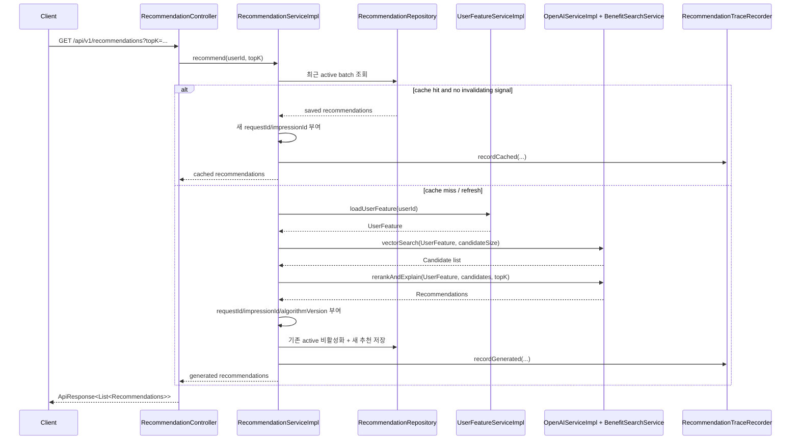
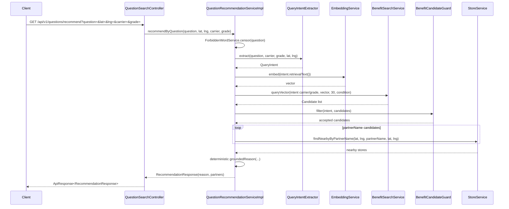

# ITPLACE 추천 시스템 아키텍처

이 문서는 `itplace-user-api`의 현재 코드 기준 추천 시스템 구조를 설명한다. 범위는 사용자-facing 추천 API인 **개인화 추천**과 **질문형 추천**, 그리고 두 흐름이 공유하는 Benefit RAG/Elasticsearch 검색 기반이다.

## 1. 시스템 범위

| 구분 | 엔드포인트 | 주 구현 | 용도 |
| --- | --- | --- | --- |
| 개인화 추천 | `GET /api/v1/recommendations` | `recommend/*`, `ai/rag/*` | 로그인 사용자의 통신사/등급, 행동 로그, 즐겨찾기, ES 벡터 후보를 조합해 제휴처/혜택 추천 |
| 질문형 추천 | `GET /api/v1/questions/recommend` | `ai/question/*`, `ai/rag/*` | 사용자의 자연어 질문과 위치를 기반으로 근처에서 이용 가능한 제휴처 추천 |
| 질문 메모리 검색 | `GET /api/v1/questions/search` | `QuestionSearchController#searchSimilarQuestion` | `questions` ES 인덱스 검색용 deprecated/offline 성격 보조 API |
| 추천 추적/평가 기반 | 내부 저장 | `recommend/trace/*`, `RecommendationTraceRecorder` | 개인화 추천 요청 단위 rank trace와 응답 attribution 저장 |

## 2. 주요 컴포넌트

### 2.1 개인화 추천 패키지

- `recommend/controller/RecommendationController.java`
  - `/api/v1/recommendations` HTTP 진입점.
  - `@AuthenticationPrincipal PrincipalDetails`에서 `userId`를 가져와 서비스 호출.
- `recommend/service/RecommendationServiceImpl.java`
  - 개인화 추천 orchestration 담당.
  - 캐시 조회, invalidation 판단, 사용자 feature 로딩, 후보 검색, 재랭킹, 저장, trace 기록을 수행.
- `recommend/service/UserFeatureServiceImpl.java`
  - 사용자 profile, Mongo 행동 로그, 즐겨찾기를 `UserFeature`로 조립.
- `recommend/service/OpenAIServiceImpl.java`
  - 개인화 추천의 ES 벡터 후보 조회 위임, deterministic rank 계산, LLM JSON 응답 constraint, fallback 추천 생성 담당.
- `recommend/repository/RecommendationRepository.java`
  - `recommendations` RDB 테이블의 active batch/cache 조회와 비활성화 담당.
- `recommend/service/RecommendationTraceRecorder.java`
  - 요청별 rank trace를 `recommendation_rank_traces`에 저장.

### 2.2 질문형 추천 패키지

- `ai/question/controller/QuestionSearchController.java`
  - `/api/v1/questions/recommend` 진입점.
  - `/api/v1/questions/search`는 deprecated 검색 보조 API.
- `ai/question/service/QuestionRecommendationServiceImpl.java`
  - 질문 금칙어 검사, intent 추출, 임베딩, Benefit RAG 검색, guard 필터링, 주변 매장 조회, grounded reason 생성을 담당.
- `ai/question/intent/QueryIntentExtractor.java`
  - carrier/grade, 목적 키워드, 카테고리 힌트, 제외 힌트, 위치 컨텍스트, confidence를 규칙 기반으로 추출.
- `ai/question/guard/BenefitCandidateGuard.java`
  - 후보가 통신사/등급/intent와 맞는지 필터링하고, 중복 제거 및 intent match score 기반 정렬 수행.

### 2.3 공통 Benefit RAG / 검색 패키지

- `ai/rag/service/EmbeddingServiceImpl.java`
  - OpenAI embedding API로 사용자 feature 또는 질문 intent text를 벡터화.
- `ai/rag/service/BenefitSearchServiceImpl.java`
  - Elasticsearch `benefit` 인덱스에서 KNN 검색 수행.
  - carrier, grade, active, businessType/useCase 조건을 ES filter와 사후 검증에 모두 적용.
  - ES 실패 또는 결과 없음 시 DB fallback 후보 생성.
- `recommend/dto/Candidate.java`
  - 개인화/질문형 추천이 공유하는 후보 DTO.
  - benefit/partner/policy/tier, category, carrier/grade, semantic score, rank score, candidate source, score components 포함.

## 3. 개인화 추천 흐름



### 3.1 캐시 정책

- `EXPIRED_DAYS = 1` 기준으로 최근 active 추천 batch를 찾는다.
- 최근 batch가 있고, 추천 이후 invalidating signal이 없으면 cache hit으로 반환한다.
- invalidating signal 후보:
  - Mongo log event: `click`, `detail`, `search`, `recommendation_click`, `search_result_click`, `benefit_detail_view`, `favorite_add`, `favorite_remove`, `benefit_use`, `impression`, `dismiss`, `skip`, `negative`, `negative_feedback`, `feedback_negative`, `not_interested`
  - Favorite 생성일 변경
  - User profile `lastModifiedDate` 변경
- cache hit 응답도 요청별 새 `requestId`와 `impressionId`를 부여하고 `cached_recommendation` fallback flag를 남긴다.

### 3.2 UserFeature 생성

`UserFeatureServiceImpl`은 다음 신호를 조립한다.

| 신호 | 출처 | 현재 반영 방식 |
| --- | --- | --- |
| 통신사/등급 | `User.carrier`, `User.membershipGradeCode` | ES 후보 필터 및 LLM/embedding context에 사용 |
| 클릭/검색/상세 로그 | Mongo `logs` aggregation | partner affinity score 계산 |
| 즐겨찾기 | `FavoriteRepository.findByUserIdWithBenefitAndPartner` | partner affinity score 계산 |
| 노출 피로 | `impression` 로그 | 클릭/상세/즐겨찾기 없는 partner에 negative score 부여 |
| 부정 신호 | `favorite_remove`, `dismiss`, `skip`, `negative*` 로그 | negative score 및 tombstone partner 계산 |
| 위치 컨텍스트 | 특정 location event의 `param` | `KNOWN(...)` 또는 `UNKNOWN` 문자열로 embedding/LLM context에 포함 |

현재 코드상 `topCategories`, `benefitUsageCounts`, `categoryAffinityScores`는 빈 값으로 구성된다. 따라서 개인화 랭킹의 중심은 partner 단위 행동/즐겨찾기/부정 신호와 ES semantic score다.

### 3.3 후보 검색과 랭킹

1. `RecommendationServiceImpl#candidateSize(topK)`가 후보 개수를 계산한다.
   - `topK * 3`을 기본으로 하되 최소 10, 최대 20.
2. `OpenAIServiceImpl#vectorSearch`가 `BenefitSearchService.queryVector(carrier, grade, embedding, candidateSize)`를 호출한다.
3. `BenefitSearchServiceImpl`은 ES `benefit` 인덱스 KNN 검색을 수행한다.
   - `active=true`, carrier, grade 또는 all-grade 필터 적용.
   - ES 실패/빈 결과 시 DB fallback 후보 생성.
4. `OpenAIServiceImpl#deterministicRank`가 후보별 rank score를 계산한다.

현재 rank score 공식:

```text
rankScore = semanticScore * 20
          + behaviorAffinity
          + categoryAffinity * 0.5
          + groundedUserSignal
          - negativePartnerPenalty
          - tombstonePenalty
```

score component key 예:

- `semantic_similarity`
- `behavior_affinity`
- `category_affinity`
- `grounded_user_signal`
- `negative_partner_penalty`
- `tombstone_penalty`
- `source_es_vector`
- `source_db_fallback`

### 3.4 LLM 설명 및 fallback

- `OpenAIServiceImpl#rerankAndExplain`은 deterministic rank 상위 후보 최대 15개를 prompt에 넣는다.
- OpenAI chat completion은 JSON object 응답을 요구한다.
- LLM이 반환한 `partnerName`은 prompt 후보에 존재하는 partner만 허용된다.
- 중복 partner와 후보 밖 partner는 제거된다.
- 부족한 결과는 deterministic 후보 순서로 backfill된다.
- OpenAI 실패/timeout/파싱 실패 시 template fallback 추천을 반환한다.
- 응답 개수는 `MAX_RECOMMENDATION_COUNT = 5`로 제한된다. 컨트롤러/클라이언트의 기본 `topK=10`과 다르게 실제 생성 상한은 5다.

## 4. 개인화 추천 응답과 저장 모델

### 4.1 API 응답 DTO

`Recommendations` 응답 필드:

| 필드 | 설명 |
| --- | --- |
| `rank` | 표시 순위 |
| `partnerName` | 추천 제휴처명 |
| `reason` | 사용자에게 노출되는 추천 이유 |
| `imgUrl` | 제휴처 이미지 URL |
| `benefitIds` | 추천과 연결된 혜택 ID 목록 |
| `requestId` | 추천 요청 attribution ID |
| `impressionId` | 표시된 추천 item attribution ID |
| `candidateSource` | `es_vector`, `db_fallback`, `cached_recommendation`, `unknown` 등 |
| `algorithmVersion` | 현재 `personalized-es-quality-v1` |
| `fallbackFlags` | `openai_fallback`, `llm_backfill`, `cached_recommendation`, 빈 배열 등 |

`scoreComponents`는 DTO 내부에 있지만 `@JsonIgnore`라서 API 응답으로 노출하지 않고 rank trace 저장에 사용한다.

### 4.2 RDB 저장

- `recommendations`
  - 추천 결과 cache/history 저장.
  - 주요 필드: `user`, `ranking`, `partnerName`, `reason`, `imgUrl`, `cacheBatchId`, `requestId`, `impressionId`, `candidateSource`, `algorithmVersion`, `active`, `benefits`.
- `recommendation_benefits`
  - 추천과 혜택의 N:M 연결.
- `recommendation_rank_traces`
  - 요청 단위 trace 저장.
  - 주요 필드: `requestId`, `userId`, `serviceType`, `algorithmVersion`, `experimentArm`, `cacheStatus`, `invalidationReason`, `attributionComplete`, `traceJson`.

운영 환경은 `ddl-auto=validate`이므로 다음 SQL을 배포 전에 적용해야 한다.

- `src/main/resources/db/recommendation_trace_attribution.sql`

## 5. Rank trace 구조

개인화 추천 요청 1회마다 `RecommendationRankTrace`가 JSON으로 저장된다.

| 필드 | 의미 |
| --- | --- |
| `requestId` | 요청 단위 ID |
| `serviceType` | `personalized_recommendation` |
| `algorithmVersion` | 추천 알고리즘 버전 |
| `experimentArm` | 현재 `personalized_es_quality_v1` |
| `candidateIds` | 최종 표시 전 후보 benefit ID 목록 |
| `candidateSources` | 후보별 source |
| `scoreComponents` | 후보별 점수 구성 요소 |
| `shownIds` | 사용자에게 반환한 benefit ID 목록 |
| `impressionIds` | shown item별 impression ID |
| `fallbackFlags` | shown item별 fallback 상태 |
| `latencyMs` | 현재 total latency 기록 |
| `privacyFlags` | `text_redacted`, `geo_bucketed` |

`RecommendationRankTrace#isAttributionComplete()`는 request/service/algorithm/candidate/source/score/shown/impression/fallback/latency/privacy 필드가 정렬되어 있는지 판단한다.

## 6. 질문형 추천 흐름



### 6.1 질문 intent 추출

`QueryIntentExtractor`는 자연어 질문을 규칙 기반으로 분석한다.

- carrier 추론: SKT/KT/LGU 키워드.
- grade 추론: VIP/VVIP/GOLD/SILVER/BASIC 등 carrier별 grade 키워드.
- purpose keyword: 더위, 시원한 장소, 카페/디저트/음료, 영화, 가족, 데이트, 외식, 혜택 등.
- category hint: 카페, 디저트, 영화, 쇼핑, 워터, 키즈, 레스토랑 등.
- exclusion: 상담, 결혼, 심리, 정비소, 학원 등 false route 방지용 힌트.
- location context: lat/lng가 유효하면 `KNOWN`, 아니면 `UNKNOWN`.
- confidence: carrier/grade/purpose/category 힌트 존재 여부로 계산.

### 6.2 질문형 후보 검색과 guard

- 질문형 추천은 현재 운영 경로에서 `questions` 인덱스/CSV memory를 사용하지 않고 Benefit RAG 후보만 조회한다.
- retrieval 후보 수는 `BENEFIT_RETRIEVAL_CANDIDATES = 30`.
- `searchCondition(intent)`는 purpose keyword에 따라 required/excluded business type과 use case를 구성한다.
- `BenefitCandidateGuard`는 다음 기준으로 후보를 필터링한다.
  - partnerName 존재 여부.
  - carrier/grade 일치 또는 all-grade 허용.
  - category hint와의 positive match.
  - exclusion과 충돌 여부.
  - benefitId/partnerId/name 기반 중복 제거.
- guard 통과 후보의 partnerName별로 `StoreService.findNearbyByPartnerName`을 호출해 주변 매장을 찾는다.
- 반환 partner는 최대 `MAX_PARTNER_CANDIDATES = 5`개다.

### 6.3 질문형 이유 생성

현재 `QuestionRecommendationServiceImpl`은 `OpenAIService` 필드를 주입받지만, 최종 이유 생성 경로에서는 LLM 호출 대신 `groundedReason(...)`으로 결정론적 문장을 만든다.

- 사용자 질문/intent/category/stores/partnerNames만 사용한다.
- partner별 첫 번째 tier benefit context를 bullet line으로 표시한다.
- 후보가 없으면 `NO_STORE_FOUND` 예외를 반환한다.

## 7. Elasticsearch / DB fallback 구조

`BenefitSearchServiceImpl`의 검색 계층:

1. 사용자 feature 또는 질문 intent text를 embedding vector로 만든다.
2. ES `benefit` 인덱스에서 KNN 검색한다.
3. ES hit에는 `benefitId`, `policyId`, `tierBenefitId`, metadata, score가 포함되어야 한다.
4. DB에서 Benefit/Partner/Policy/TierBenefit을 hydrate해 `Candidate`를 만든다.
5. ES가 실패하거나 결과가 비면 DB fallback 후보를 만든다.
6. fallback 후보는 `candidateSource = db_fallback`, `semanticScore = 0.0`, `source_db_fallback = 1.0` score component를 가진다.

## 8. 행동 로그와 추천 feedback loop

현재 행동 로그는 Mongo `logs` 컬렉션의 `LogDocument`에 저장된다.

주요 필드:

- `userId`
- `event`
- `benefitId`
- `benefitName`
- `partnerId`
- `partnerName`
- `path`
- `param`
- `loggingAt`

로그 생성 경로:

- `LoggingInterceptor`: benefit detail류 request click 로그.
- `BenefitLogAdvice`: benefit 검색/상세 응답 기반 `search`, `detail` 로그.
- `FavoriteServiceImpl`: `favorite_add`, `favorite_remove` 로그.

개인화 추천은 `CustomLogRepositoryImpl`의 aggregation으로 partnerName별 상위 이벤트를 읽어 feature를 만든다.

## 9. 현재 아키텍처의 명시적 한계

이 섹션은 현재 구조를 정확히 이해하기 위한 제약이다.

1. 개인화 추천 응답 개수 상한은 실제로 5개다.
   - API 기본 `topK=10`과 다르다.
2. 개인화 추천의 category affinity와 benefit usage count는 현재 빈 값이다.
   - 랭킹은 partner affinity, negative partner score, ES semantic score 중심이다.
3. 질문형 추천은 현재 개인화 rank trace 저장 흐름에 연결되어 있지 않다.
   - trace contract 문서는 question lane까지 포함하지만 구현된 `RecommendationTraceRecorder`는 개인화 추천 경로에서 사용된다.
4. 질문형 추천은 주변 매장 조회를 partner 후보별로 반복 호출한다.
5. canonical recommendation event 모델은 존재하지만, 현재 이벤트 mart 저장소로 직접 적재하는 구현은 없다.
   - 현재 새로 연결된 것은 개인화 추천의 rank trace RDB 저장이다.
6. 운영 DB에는 `recommendation_trace_attribution.sql` 적용이 선행되어야 새 trace/attribution 컬럼을 사용할 수 있다.

## 10. 주요 코드 색인

| 영역 | 파일 |
| --- | --- |
| 개인화 추천 API | `src/main/java/com/itplace/userapi/recommend/controller/RecommendationController.java` |
| 개인화 추천 orchestration | `src/main/java/com/itplace/userapi/recommend/service/RecommendationServiceImpl.java` |
| 사용자 feature 생성 | `src/main/java/com/itplace/userapi/recommend/service/UserFeatureServiceImpl.java` |
| 개인화 후보 랭킹/LLM/fallback | `src/main/java/com/itplace/userapi/recommend/service/OpenAIServiceImpl.java` |
| 추천 응답 DTO | `src/main/java/com/itplace/userapi/recommend/dto/response/Recommendations.java` |
| 추천 저장 엔티티 | `src/main/java/com/itplace/userapi/recommend/entity/Recommendation.java` |
| rank trace 저장 | `src/main/java/com/itplace/userapi/recommend/service/RecommendationTraceRecorder.java` |
| rank trace 엔티티 | `src/main/java/com/itplace/userapi/recommend/entity/RecommendationRankTraceEntity.java` |
| trace contract 모델 | `src/main/java/com/itplace/userapi/recommend/trace/RecommendationRankTrace.java` |
| 질문형 추천 API | `src/main/java/com/itplace/userapi/ai/question/controller/QuestionSearchController.java` |
| 질문형 추천 orchestration | `src/main/java/com/itplace/userapi/ai/question/service/QuestionRecommendationServiceImpl.java` |
| 질문 intent 추출 | `src/main/java/com/itplace/userapi/ai/question/intent/QueryIntentExtractor.java` |
| 질문 후보 guard | `src/main/java/com/itplace/userapi/ai/question/guard/BenefitCandidateGuard.java` |
| Benefit RAG 검색 | `src/main/java/com/itplace/userapi/ai/rag/service/BenefitSearchServiceImpl.java` |
| 문서화된 trace 계약 | `docs/recommendation-event-rank-trace-contract.md` |
| DB migration | `src/main/resources/db/recommendation_trace_attribution.sql` |
